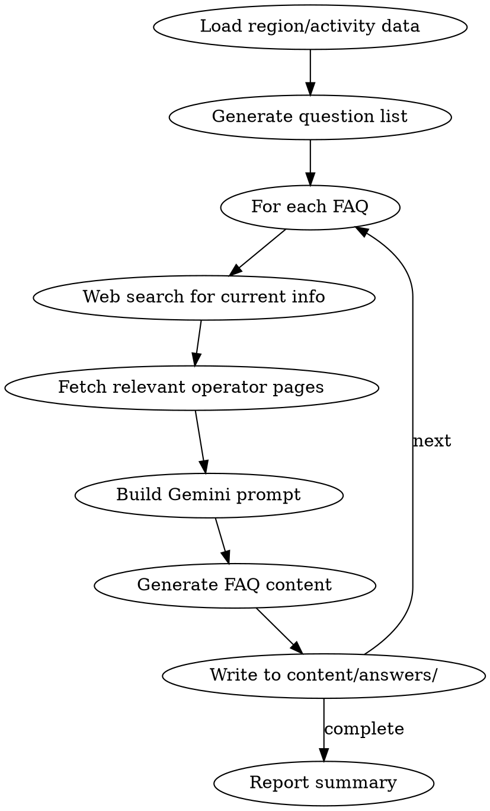

# Generate FAQs

Generate region-specific and activity-specific FAQ content for Adventure Wales using Gemini API with web research.

## Environment

Requires `GEMINI_API_KEY` environment variable.

## Usage

```
/generate-faqs <type> [target]
```

**Types:**
- `regions` - 5 FAQs per region (55 total)
- `activities` - 5 FAQs per activity (50 total)
- `all` - Everything (105 total)
- `region:<slug>` - 5 FAQs for specific region
- `activity:<slug>` - 5 FAQs for specific activity

**Examples:**
```
/generate-faqs regions
/generate-faqs activities
/generate-faqs region:snowdonia
/generate-faqs activity:coasteering
/generate-faqs all
```

## FAQ Topics

### Region FAQs (5 per region)

For each of the 11 regions, generate these question patterns:

| Pattern | Example (Snowdonia) |
|---------|---------------------|
| Best adventures in [region] | "What are the best adventures in Snowdonia?" |
| Hidden gems in [region] | "What are the hidden gems in Snowdonia?" |
| [Region] itinerary/how long | "How long should I spend in Snowdonia?" |
| [Region] with kids/families | "Is Snowdonia good for families with kids?" |
| [Region] weather/when to avoid | "When should I avoid visiting Snowdonia?" |

**Regions (11):**
- snowdonia
- pembrokeshire
- brecon-beacons
- anglesey
- gower
- llyn-peninsula
- south-wales
- north-wales
- mid-wales
- carmarthenshire
- wye-valley

### Activity FAQs (5 per activity)

For each of the 10 activities, generate these question patterns:

| Pattern | Example (Coasteering) |
|---------|----------------------|
| Fitness/ability required | "How fit do I need to be for coasteering?" |
| What to expect/first time | "What to expect on your first coasteering session?" |
| Best locations in Wales | "Where are the best coasteering spots in Wales?" |
| Beginner tips | "Coasteering tips for beginners" |
| Best time of year | "What's the best time of year for coasteering in Wales?" |

**Activities (10):**
- coasteering
- mountain-biking
- hiking
- climbing
- kayaking
- surfing
- caving
- zip-lining
- wild-swimming
- gorge-walking

## Workflow



## Output Format

Write each FAQ to `content/answers/{slug}.md`:

```markdown
---
slug: {slug}
question: "{Question}?"
region: {region|general}
activity: {activity|null}
---

# {Question}?

## Quick Answer

[Direct answer in 2-3 sentences - this is what Google will show]

## [Detailed Section 1]

[2-3 paragraphs with specific information]

## [Detailed Section 2]

[Include tables, lists, or comparisons where useful]

## Practical Tips

- [Actionable tip 1]
- [Actionable tip 2]
- [Actionable tip 3]

## Related Questions

- {Related question 1}?
- {Related question 2}?
- {Related question 3}?
```

## Gemini Prompt Template

```
You are writing FAQ content for Adventure Wales, an adventure tourism website.

TONE: Confident, practical, adventure-focused. Write like an experienced local guide who knows the terrain. Be specific (use real place names, actual prices, genuine tips). Never be generic or salesy.

QUESTION: {question}

CONTEXT FROM WEB RESEARCH:
{search results and fetched pages}

EXISTING SITE DATA:
{relevant operators, activities, locations from CSVs}

TASK:
Write a comprehensive FAQ answer following this structure:
1. Quick Answer (2-3 sentences - the TL;DR)
2. 2-3 detailed sections with specific information
3. Practical tips (3-5 actionable items)
4. Related questions (3 links to other FAQs)

REQUIREMENTS:
- Include specific operator names, locations, prices where relevant
- Add tables for comparisons
- Mention seasonal variations
- Include insider tips that only locals would know
- Reference real trails, beaches, venues by name
- Be honest about limitations or challenges
```

## Research Strategy

For each FAQ:

1. **Web Search** - Search for "{question} Wales" to get current info
2. **Fetch Pages** - Pull content from top 2-3 relevant results
3. **Cross-reference** - Match with operators/activities in our database
4. **Generate** - Use Gemini with full context

## File Naming Convention

Convert question to slug:
- "What are the best adventures in Snowdonia?" → `best-adventures-snowdonia.md`
- "How fit do I need to be for coasteering?" → `fitness-required-coasteering.md`
- "Is Snowdonia good for families with kids?" → `snowdonia-families-kids.md`

## Quality Checklist

Before writing each FAQ:
- [ ] Quick answer directly addresses the question
- [ ] Specific place names, operators, prices included
- [ ] Practical and actionable
- [ ] Honest about challenges/limitations
- [ ] Links to related content
- [ ] No generic filler content

## Batch Processing

Process in batches to manage rate limits:

```
=== REGION FAQs ===
[1/55] best-adventures-snowdonia.md ... done (823 words)
[2/55] hidden-gems-snowdonia.md ... done (756 words)
...

=== ACTIVITY FAQs ===
[1/50] fitness-required-coasteering.md ... done (691 words)
...
```

## Implementation

Use the scripts/generate-faqs.py script which:
1. Reads region/activity lists
2. Generates question variants
3. Performs web research via search
4. Calls Gemini API
5. Writes markdown files
6. Tracks progress

Run with: `python scripts/generate-faqs.py --type regions|activities|all`
